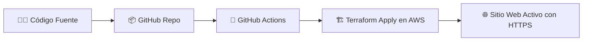

# 🛡️ Workshop: Zero-Cost Secure Static Website on AWS

Una masterclass práctica en **DevSecOps, FinOps y Cloud Engineering**, usando Terraform y GitHub Actions para desplegar un sitio web estático, seguro y automatizado en AWS.

---

## 📚 1. Introducción

Este workshop está diseñado para llevar tus habilidades en la nube al siguiente nivel. Aprenderás a construir una solución **serverless**, segura y con control de costos, aplicando prácticas reales de:

- DevOps y CI/CD
- DevSecOps
- Infraestructura como Código (IaC)
- FinOps
- SRE y automatización

---

## 🎯 2. ¿A quién está dirigido?

Este laboratorio es de nivel **intermedio**. Se espera que tengas conocimientos básicos sobre:

- Conceptos de nube (VM, S3, CDN)
- Uso de Git y línea de comandos
- Fundamentos de IaC

Cada paso está documentado para que puedas seguirlo sin experiencia avanzada.

---

## 🧰 3. Tecnologías y Disciplinas

| Disciplina              | Herramienta / Concepto                 | Propósito en el Workshop |
|-------------------------|----------------------------------------|---------------------------|
| Cloud Engineering       | AWS (S3, CloudFront, ACM, Route 53)    | Infraestructura serverless |
| Infraestructura como Código | Terraform                         | Infraestructura reproducible |
| DevOps / CI/CD          | GitHub Actions                         | Automatización del despliegue |
| DevSecOps               | AWS WAF, OAC, Security Headers         | Seguridad desde el diseño |
| FinOps                  | AWS Budgets, tagging, destrucción      | Control de costos y limpieza |

---

## 🏗️ 4. Arquitectura de la Solución

El flujo completo incluye:

- **Desarrollador**: Cambia código en `/src` o infraestructura en `/terraform`
- **GitHub Actions**: Detecta cambios en `main` y ejecuta el pipeline
- **Terraform**: Despliega recursos en AWS:
  - Route 53: DNS
  - ACM: Certificado SSL
  - S3 Bucket: Archivos estáticos
  - CloudFront: CDN con HTTPS
  - OAC: Acceso seguro al bucket
  - WAF: Protección contra ataques
  - CloudFront Function: Cabeceras de seguridad
- **FinOps**: AWS Budgets alerta si se supera el umbral de costos
- **Destrucción**: Workflow manual (`destroy.yml`) elimina todo para evitar cargos

---

## 🧪 5. Flujo CI/CD



---

## 🔧 6. Prerrequisitos

| Componente        | Propósito |
|-------------------|-----------|
| Cuenta AWS        | Desplegar infraestructura |
| Dominio registrado| Acceso HTTPS personalizado |
| Cuenta GitHub     | Ejecutar CI/CD |
| Terraform CLI     | Pruebas locales |
| AWS CLI           | Configurar credenciales |

---

## 📁 7. Estructura del Repositorio

```
aws-serverless-secure-website-workshop/
├── src/                  # Código HTML del sitio
├── terraform/            # Infraestructura como código
├── .github/workflows/    # Pipelines CI/CD
├── README.md             # Documentación principal
├── LICENSE               # Licencia MIT
```

---

## 🚀 8. Guía Paso a Paso

1. **Fork y clona el repo**
2. **Configura secretos en GitHub** (`AWS_ACCESS_KEY_ID`, `AWS_SECRET_ACCESS_KEY`)
3. **Edita `variables.tf` con tu dominio y correo**
4. **Haz push a `main` y aprueba el workflow**
5. **Accede a tu sitio en `https://tudominio.com`**

---

## 💸 9. FinOps y Destrucción Segura

- Terraform crea un presupuesto en AWS Budgets
- Si superas el umbral, recibirás una alerta
- Ejecuta el workflow `destroy.yml` para eliminar todo y evitar cargos

---

## 👨‍🏫 10. Autor

**Jesús Garagorry**  
[🔗 LinkedIn](https://www.linkedin.com/in/jgaragorry/) · [🐙 GitHub](https://github.com/jgaragorry) · [📺 YouTube](https://www.youtube.com/@Softraincorp)

---

## 📄 11. Licencia

Este proyecto se distribuye bajo la licencia MIT. Consulta el archivo LICENSE para más detalles.

