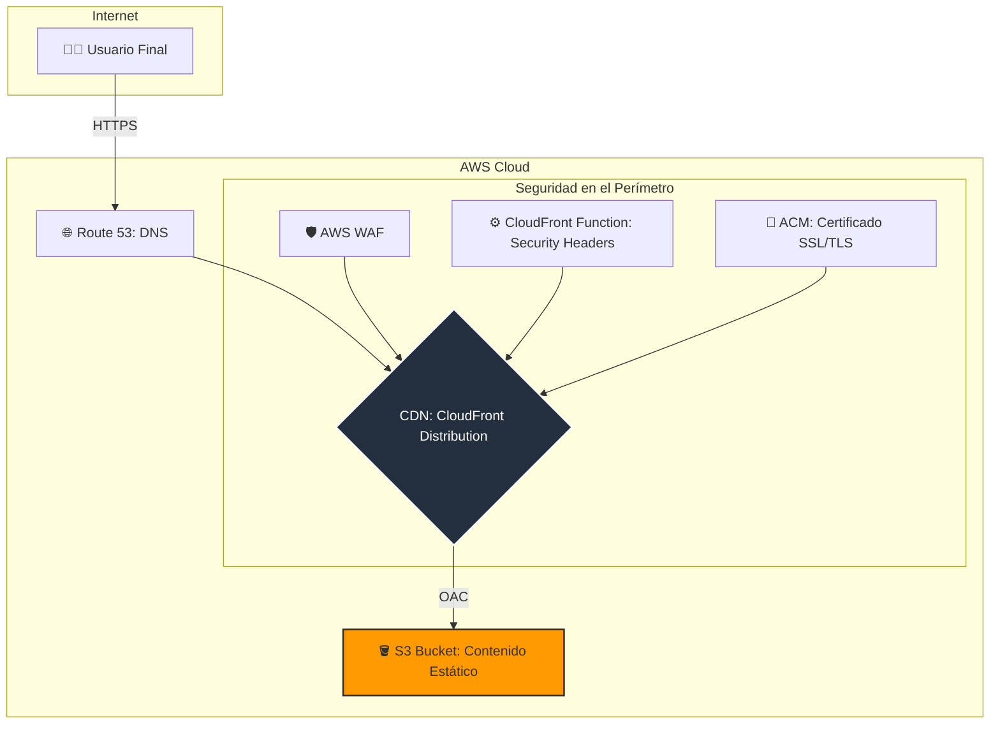
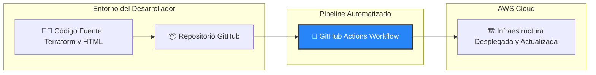

<h1 align="center">Workshop: Zero-Cost Secure Static Website on AWS</h1>
<h3 align="center">A DevSecOps & FinOps Masterclass with Terraform & GitHub Actions</h3>

<p align="center">
  <strong>Autor:</strong> Jesús Garagorry<br/>
  <a href="https://www.linkedin.com/in/jgaragorry/" target="_blank">
    
  </a>
  <a href="https://github.com/jgaragorry" target="_blank">
    
  </a>
  <a href="https://www.youtube.com/@Softraincorp" target="_blank">
    
  </a>
</p>

<p align="center">
  
  
  
  
</p>

---

## 📜 Tabla de Contenido
1. [Introducción](#-1-introducción-al-workshop)
2. [Arquitectura de la Solución](#-2-arquitectura-de-la-solución)
3. [Prerrequisitos](#-3-prerrequisitos)
4. [Guía Paso a Paso](#-4-manos-a-la-obra-guía-paso-a-paso)
5. [Guía de lo Aprendido (How-To)](#-5-guía-de-lo-aprendido-how-to-resumen)
6. [Solución de Problemas y Próximos Pasos](#-6-solución-de-problemas-y-próximos-pasos)
7. [Licencia](#-7-licencia)

---

## 🎯 1. Introducción al Workshop

¡Bienvenido a este workshop práctico diseñado para llevar tus habilidades en la nube al siguiente nivel! El objetivo es desplegar una aplicación web estática en AWS de manera **segura, automatizada y con un enfoque proactivo en el control de costos (FinOps)**.

A través de este ejercicio, no solo construirás una solución funcional, sino que también comprenderás y aplicarás las mejores prácticas de **DevOps, DevSecOps, SRE y Cloud Engineering**, creando un proyecto tangible y de alto valor para tu portafolio profesional.

[⬆️ Ir al Inicio](#-tabla-de-contenido)

---

## 🏗️ 2. Arquitectura de la Solución

La solución que implementaremos es 100% serverless, lo que significa que no gestionaremos servidores, y solo pagaremos por el uso real (que, para un sitio con tráfico bajo-medio, estará dentro de la capa gratuita de AWS).

<details>
  <summary><strong>Ver Diagrama de Arquitectura de la Aplicación</strong></summary>


</details>

<details>
  <summary><strong>Ver Diagrama del Flujo CI/CD</strong></summary>


</details>

[⬆️ Ir al Inicio](#-tabla-de-contenido)

---

## 🛠️ 3. Prerrequisitos

<details>
  <summary><strong>Haz clic aquí para ver los prerrequisitos necesarios.</strong></summary>

- Cuenta activa en AWS
- Dominio registrado
- Terraform instalado localmente
- Repositorio GitHub con permisos para usar GitHub Actions
</details>

---

## 🚀 4. ¡Manos a la Obra! Guía Paso a Paso

### Paso 0: ⚙️ Configuración Inicial

1. **Fork y Clonación del Repositorio**

```bash
git clone https://github.com/TU_USUARIO/aws-serverless-secure-website-workshop.git
```

2. **Configuración de Credenciales de AWS en GitHub**

- Crea un usuario IAM con permisos de `AdministratorAccess`
- Añade los secretos en GitHub:
  - `AWS_ACCESS_KEY_ID`
  - `AWS_SECRET_ACCESS_KEY`

3. **Configuración del Dominio en Route 53**

- Crea una zona hospedada pública
- Actualiza los NS en tu registrador

### Paso 1: 🏗️ Despliegue y Validación

- Edita `terraform/variables.tf` con tu dominio y correo
- Haz push de los cambios
- Aprueba el workflow en GitHub Actions
- Verifica tu sitio en `https://www.tu-dominio.com`

---

## 📚 5. Guía de lo Aprendido (How-To Resumen)

✅ Cloud Engineering: Arquitectura serverless con S3, CloudFront, Route 53, ACM  
✅ IaC: Terraform para infraestructura reproducible  
✅ CI/CD: GitHub Actions con aprobación manual  
✅ DevSecOps: Seguridad en el perímetro y origen  
✅ FinOps: Control de costos con AWS Budgets

---

## 🐛 6. Solución de Problemas y Próximos Pasos

### Problemas Comunes

- Certificado ACM no validado: espera propagación DNS
- Access Denied: revisa política del bucket y OAC
- Pipeline fallido: revisa secretos en GitHub

### Ideas Futuras

- Monitoreo con CloudWatch + SNS  
- Backend serverless con API Gateway + Lambda  
- Pruebas DAST con OWASP ZAP

---

## © 7. Licencia

Este proyecto se distribuye bajo la licencia MIT. Consulta el archivo LICENSE para más detalles.

