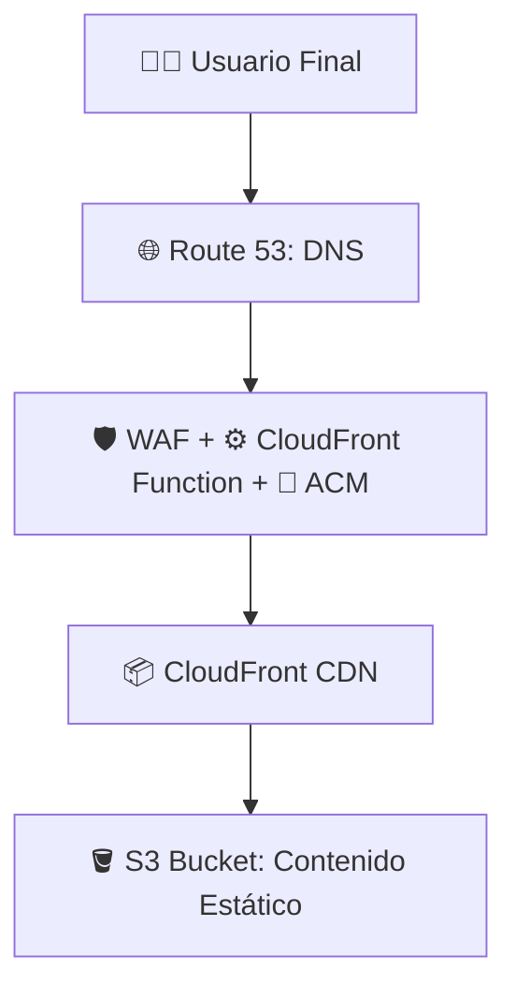
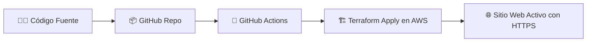

# 🛡️ Workshop: Zero-Cost Secure Static Website on AWS

Una masterclass práctica en **DevSecOps, FinOps y Cloud Engineering**, usando Terraform y GitHub Actions para desplegar un sitio web estático, seguro y automatizado en AWS.

---

## 📚 1. Introducción

Este workshop te guía paso a paso para construir una solución **serverless**, segura y con control de costos, aplicando prácticas reales de:

- DevOps y CI/CD
- DevSecOps
- Infraestructura como Código (IaC)
- FinOps
- SRE y automatización

Ideal para quienes buscan un proyecto tangible y profesional para su portafolio.

---

## 🎯 2. Público Objetivo

Nivel **intermedio**. Se recomienda tener conocimientos básicos en:

- Conceptos de nube (S3, CDN, DNS)
- Git y línea de comandos
- Fundamentos de Terraform

Cada paso está documentado para facilitar el aprendizaje autodidacta.

---

## 🧰 3. Tecnologías y Disciplinas

| Disciplina              | Herramienta / Concepto                 | Propósito en el Workshop |
|-------------------------|----------------------------------------|---------------------------|
| Cloud Engineering       | AWS (S3, CloudFront, ACM, Route 53)    | Infraestructura serverless |
| Infraestructura como Código | Terraform                         | Infraestructura reproducible |
| DevOps / CI/CD          | GitHub Actions                         | Automatización del despliegue |
| DevSecOps               | AWS WAF, OAC, Security Headers         | Seguridad desde el diseño |
| FinOps                  | AWS Budgets, tagging, destrucción      | Control de costos y limpieza |

---

## 🏗️ 4. Arquitectura de la Solución



- **Seguridad**: WAF, HTTPS, cabeceras seguras
- **Automatización**: Terraform + GitHub Actions
- **Costo controlado**: AWS Budgets + destrucción segura

---

## 🧪 5. Flujo CI/CD



---

## 🔧 6. Prerrequisitos

| Componente        | Propósito |
|-------------------|-----------|
| Cuenta AWS        | Desplegar infraestructura |
| Dominio registrado| Acceso HTTPS personalizado |
| Cuenta GitHub     | Ejecutar CI/CD |
| Terraform CLI     | Pruebas locales |
| AWS CLI           | Configurar credenciales |

---

## 📁 7. Estructura del Repositorio

```
aws-serverless-secure-website-workshop/
├── src/                  # Código HTML del sitio
├── terraform/            # Infraestructura como código
├── .github/workflows/    # Pipelines CI/CD
├── docs/                 # Documentación extendida (opcional)
├── README.md             # Documentación principal
├── LICENSE               # Licencia MIT
├── SECURITY.md           # Política de seguridad
```

---

## 🚀 8. Guía Paso a Paso

1. **Fork y clona el repo**
2. **Configura secretos en GitHub** (`AWS_ACCESS_KEY_ID`, `AWS_SECRET_ACCESS_KEY`)
3. **Edita `terraform/variables.tf` con tu dominio y correo**
4. **Haz push a `main` y aprueba el workflow**
5. **Accede a tu sitio en `https://tudominio.com`**

---

## ✅ 9. Validación post-deploy

Una vez desplegado el sitio, valida que esté seguro y optimizado:

- [SSL Labs](https://www.ssllabs.com/ssltest/) — Verifica el certificado HTTPS
- [SecurityHeaders.com](https://securityheaders.com/) — Evalúa cabeceras de seguridad
- [Lighthouse](https://developers.google.com/web/tools/lighthouse) — Audita performance y accesibilidad

---

## 🧪 10. Validación local (opcional)

Antes de hacer push, puedes validar localmente:

```bash
cd terraform
terraform init
terraform plan
terraform apply
```

Recuerda destruir los recursos si estás en entorno de pruebas:

```bash
terraform destroy
```

---

## 💸 11. FinOps y Destrucción Segura

- Terraform crea un presupuesto en AWS Budgets
- Si superas el umbral, recibirás una alerta
- Ejecuta el workflow `destroy.yml` para eliminar todo y evitar cargos innecesarios

---

## 🧠 12. Documentación extendida (opcional)

Puedes añadir explicaciones didácticas en `/docs/` para principiantes:

- `docs/que-es-cloudfront.md`
- `docs/por-que-usar-oac.md`
- `docs/finops-en-aws.md`

---

## 👨‍🏫 13. Autor

**Jesús Garagorry**  
[🔗 LinkedIn](https://www.linkedin.com/in/jgaragorry/) · [🐙 GitHub](https://github.com/jgaragorry) · [📺 YouTube](https://www.youtube.com/@Softraincorp)

---

## 📄 14. Licencia

Este proyecto se distribuye bajo la licencia MIT. Consulta el archivo LICENSE para más detalles.

